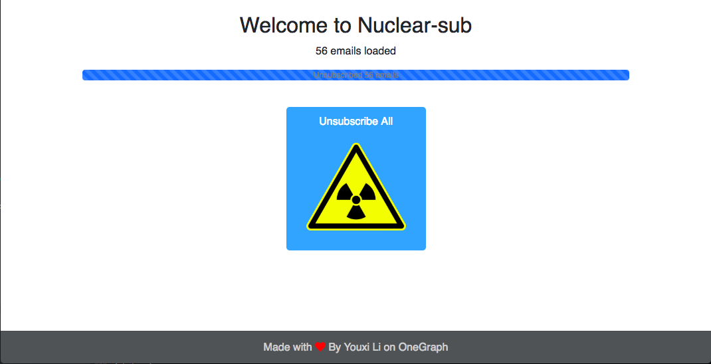
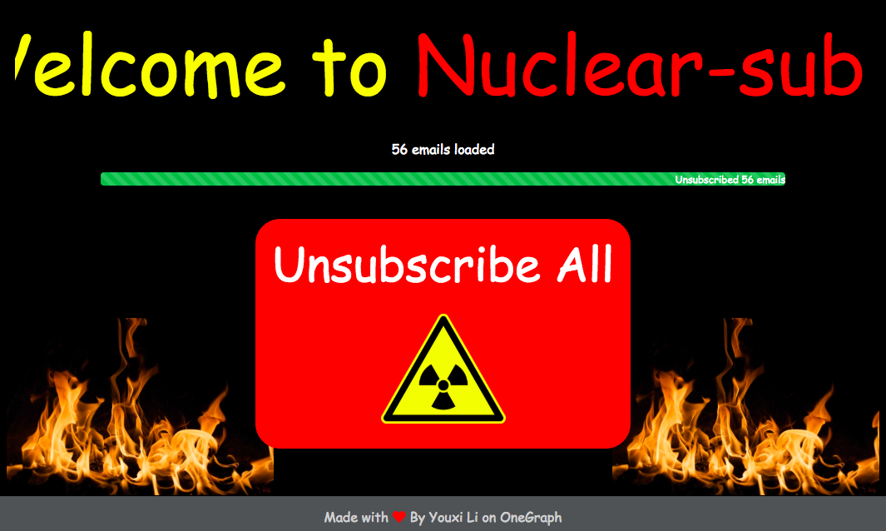

# Nuclear-sub

This is a web app that enables users to unsubscribe from all the unwanted emails.

## Runing on localhost:

### Setup a OneGraph app:

Sign up at https://www.onegraph.com, create an app, and grab its id.

Open `client/src/App.js` and put the APP_ID in there.

*Remember to add localhost to your app's CORS origins.

### Setup Postgresql:

Establish connection to your Postgres Database by replaceing the `connectionString` in `server.js` and `create_db.js`.

Create tables by running `node create_db.js`. 

### Run the command:

```
cd client
yarn
cd ..
yarn 
yarn dev
```

*You can uncommnet client/src/App.js line 219 `isNuclear: true,` to see the NUCLEAR version!!

## Examples



